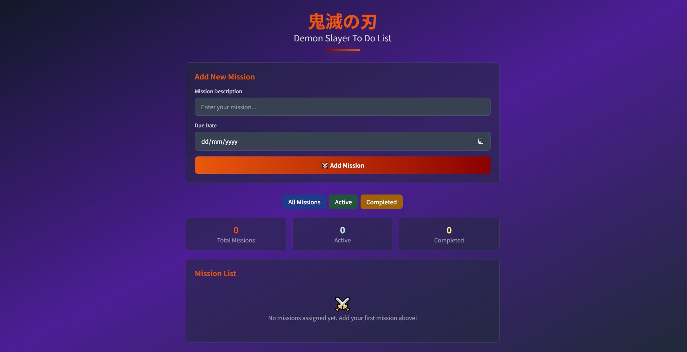
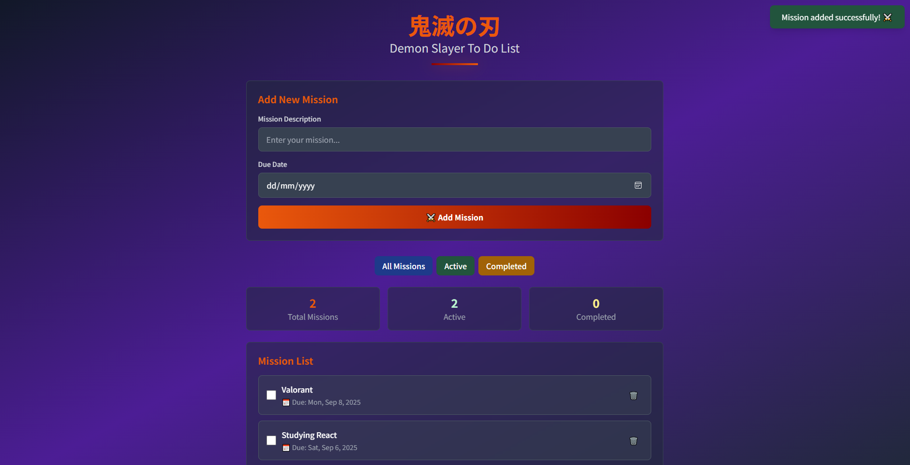
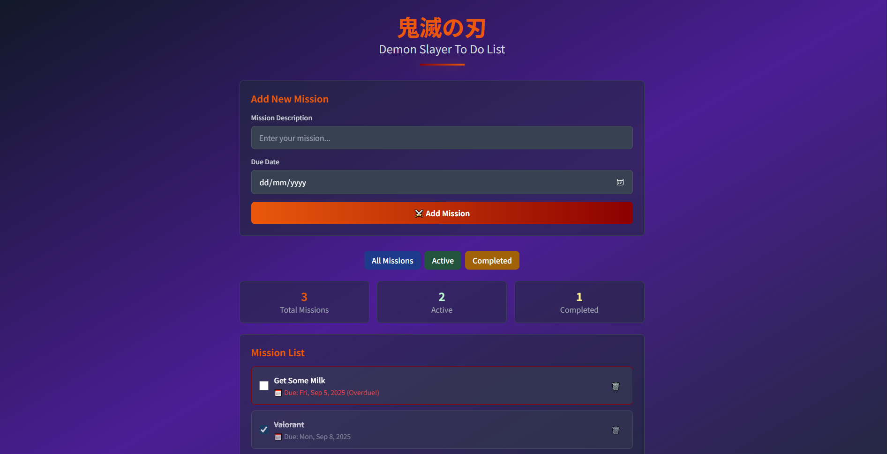

# Demon Slayer To-Do List Web App



A stylish and interactive to-do list web application inspired by the Demon Slayer theme. This app allows users to manage their tasks (missions) with features like task filtering, validation, and local storage support.

## Features

- **Add Missions**: Add new tasks with a description and due date.
- **Task Validation**: Ensures mission descriptions are at least 3 characters long and due dates are not in the past.
- **Mark as Completed**: Toggle tasks as completed or active.
- **Delete Missions**: Remove tasks from the list.
- **Filter Missions**: View all, active, or completed tasks.
- **Statistics**: Displays the total, active, and completed tasks.
- **Local Storage**: Saves tasks in the browser's local storage for persistence.
- **Responsive Design**: Works seamlessly on both desktop and mobile devices.

## Screenshots

### Add New Mission


### Mission List



## Technologies Used

- **HTML**: Structure of the web app.
- **CSS (Tailwind CSS)**: Styling and animations.
- **JavaScript**: Logic for task management and interactivity.
- **Local Storage**: Persistent storage for tasks.

## How to Run

1. Clone the repository:
   ```bash
   git clone https://github.com/LosenEinzieg/DOM-Project-Demon-Slayer-To-Do-List-Web-App.git
   ```
2. Navigate to the project directory:
   ```bash
   cd demon-slayer-todo-app
   ```
3. Open `index.html` in your browser.

## Project Structure

```
index.html
js/
  script.js
screenshots/
  header.png
  add-mission.png
  mission-list.png
```

## Future Enhancements

- Add support for task categories.
- Implement a dark/light mode toggle.
- Add animations for task transitions.

## License

This project is licensed under the MIT License. Feel free to use and modify it as you like.

---

⚔️ **Happy Task Slaying!**
